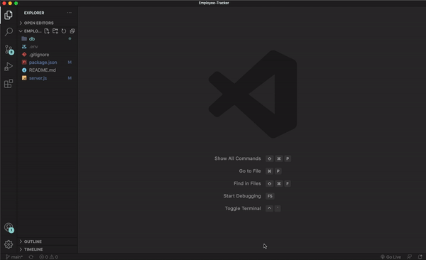

# Employee-Tracker

<a href="https://choosealicense.com/licenses/mit" target="_blank"></a>

## Table of Contents

- [Description](#description)
- [Instalation](#installation)
- [Usage](#usage)
- [Video](#video)

## Description

Employee-Tracker is a command-line appication that manages a company's employee database, using Node.js, Inquierer, and MYSQL.

## Installation

First, ensure node.js is installed on your computer.
Next, clone this repository. Open the repository in a code editory such as VS Code.

## Usage

After cloning the repository to your computer, follow the next steps:

1. Open Employee-Tracker repository in VS Code

2. Open Terminal

3. Split Terminal so that you have two terminals displayed in VS Code side by side.

4. In Terminal 1, type the syntax below.
   a. Begin MYSQL login

   ```bash
   mysql -u root -p
   ```

   b. Enter your MYSQL password.
   c. Execute schema.sql query.

   ```bash
   source db/schema.sql
   ```

   d. Execute seeds.sql query.

   ```bash
   source db/seeds.sql
   ```

   f. List the tables in employeetracker_db.

   ```bash
   show tables;
   ```

   g. Select all the fields available in the department table.

   ```bash
   select * from department;
   ```

5. In Terminal 2, type the syntax below.
   a. Install the dependencies.

   ```bash
   npm install
   ```

   b. Run the application

   ```bash
   node server.js
   ```

## Video

Link to [Employee-Tracker GIF](https://github.com/azs6189/Employee-Tracker/blob/main/Employee-Tracker.gif)


